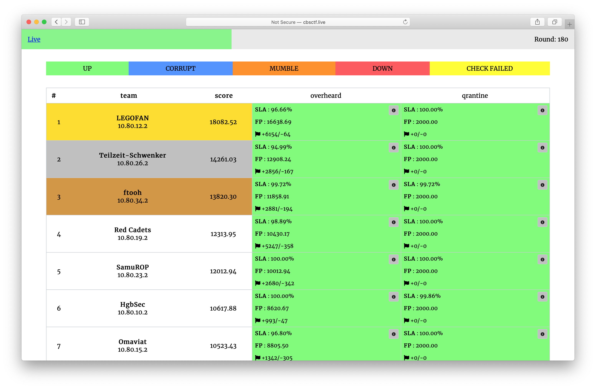

# C4tty Blitz #2

The contest was held on June 14, 2020.

Repository contains source code of services, checkers and sploits.

## Results

[Full scoreboard](scoreboard/full.png)

## Services

| Service | Language | Checker | Sploits | Authors |
|---------|----------|---------|---------|---------|
| **[overheard](services/overheard/)** | Php & C & Lua | [Checker](checkers/overheard/) | [Sploits](sploits/overheard/) | [@jnovikov](https://github.com/jnovikov) |
| **[qrantine](services/qrantine/)** | NodeJs | [Checker](checkers/qrantine/) | [Sploits](sploits/qrantine/) | [@kekov](https://github.com/xmikasax)|

## Infrastructure

- DevOps: [@pomo_mondreganto](https://github.com/pomo-mondreganto)
- Checksystem: [ForcAD](https://github.com/pomo-mondreganto/ForcAD)

## Donation

We organize our CTFs and trainings on a regular basis. Though our infrastructure is cost-optimized, it is not 0. So we are open for donations if you want to support us. Vulnbox costs ~3$ per team.

Paypal: https://www.paypal.me/pomomondreganto

Tinkoff (roubles or if you have a multi wallet card): https://www.tinkoff.ru/sl/3JBSc9Kgiy0

DStream: https://donate.stream/cbsctf

Bitcoin: 1F6XjKjCMvHseScedHyH2xFpLybFGAfgZP
